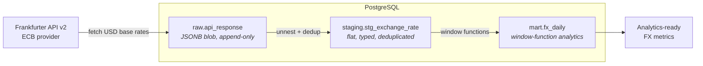

# currency-api-v2

An incremental **ELT pipeline** that ingests foreign-exchange rates from the Frankfurter API into PostgreSQL, following a **medallion architecture** (raw → staging → mart). Transformation logic lives in SQL and runs inside the database, not in the application layer.

> **Why this design?** ELT keeps raw data immutable and replayable, pushes all transformation into SQL where it can be tested and version-controlled, and mirrors how modern analytics platforms (BigQuery, Snowflake, Redshift) are built.

---

## Architecture



| Layer | Table | Role |
|-------|-------|------|
| **Raw** | `raw.api_response` | Stores the unmodified JSON payload as `JSONB`, append-only. Enables full replay and audit — if a transform is wrong, the source of truth is never lost. |
| **Staging** | `staging.stg_exchange_rate` | Unnests the JSON into flat, strongly-typed rows. Deduplicated with `ROW_NUMBER()` and upserted via `ON CONFLICT` on the natural key `(source_date, base_currency, target_currency)`. |
| **Mart** | `mart.fx_daily` | Business-ready metrics computed with window functions: previous-day rate, daily % change, 7-day and 30-day moving averages, and 30-day volatility. |

---

## Tech Stack

| Concern | Choice |
|---------|--------|
| Language | Python 3 (`requests`, `SQLAlchemy`, `python-dotenv`, `logging`) |
| Database | PostgreSQL |
| Data source | [Frankfurter API v2](https://frankfurter.dev) (ECB provider) |
| Transformation | SQL (executed in-database) |
| Linting | SQLFluff |

---

## Data Source Notes

- **Base currency:** USD &nbsp;·&nbsp; **Quotes:** THB, JPY, EUR, GBP, SGD
- **Provider pinned to ECB.** Frankfurter aggregates rates from many central banks; pinning to a single provider (ECB) avoids blended-rate drift and keeps the series consistent.
- **The real data gap is missing _dates_, not missing currency pairs.** The ECB does not publish on weekends or European holidays, so the pipeline is built to tolerate non-continuous date coverage rather than assume a daily row for every calendar day.

---

## How to Run

**Prerequisites:** Python 3.10+ (developed on 3.14.0), a running PostgreSQL instance.

1. **Clone and install dependencies**
   ```bash
   git clone https://github.com/Kirakiraz/currency-api-v2.git
   cd currency-api-v2
   pip install -r requirements.txt
   ```

2. **Configure environment**
   ```bash
   cp .env.example .env
   # edit .env with your PostgreSQL credentials
   ```

3. **Create the database and initialize schemas** (one-time)
   ```bash
   createdb currency_db
   psql -d currency_db -f init.sql
   ```
   > The database name must match `DB_NAME` in your `.env`.

4. **Run the pipeline**
   ```bash
   python main.py
   ```

The pipeline is **incremental**: on each run it reads the latest `source_date` already in staging and fetches only the missing dates. On a fresh database it backfills from a configured start date.

---

## Design Decisions

- **ELT over ETL** — Raw payloads land first; transformation happens in SQL inside PostgreSQL. This keeps the source immutable and makes every transform reproducible and reviewable.
- **JSONB raw layer** — Storing the raw API response means any downstream logic can be re-derived without re-calling the API. Cheap audit and replay.
- **Incremental loading** — `get_last_loaded_date()` queries the max `source_date` in staging so each run pulls only new data, avoiding redundant API calls and re-inserts.
- **Defensive transforms** — `NULLIF` guards against division-by-zero in percentage-change calculations; `ROW_NUMBER()` enforces one row per natural key before the upsert.
- **Idempotent upserts** — `ON CONFLICT` on the natural key means re-running the pipeline never produces duplicates.

---

## Future Improvements

- **Incremental staging transform.** The staging step currently re-processes the full raw table on every run — `ROW_NUMBER()` produces correct results, but the work is wasteful at scale. `load_to_raw()` already returns the new `raw.id`, which can be used to transform only newly-landed rows.
- **Cloud migration.** Port the warehouse to BigQuery to practise a production-grade modern data stack, and add scheduled orchestration (e.g. Cloud Composer / Airflow) in place of manual runs.
- **Data quality checks.** Add automated validation (row counts, null checks, rate sanity bounds) between layers.
- **Tests.** Add `pytest` coverage for the extract/load functions.

---

## Project Structure

```
currency-api-v2/
├── sql/
│   ├── transform_staging.sql   # unnest + dedup raw → staging
│   └── transform_mart.sql      # window-function analytics → mart
├── init.sql                    # DDL for all schemas/tables (run once)
├── main.py                     # fetch + load + orchestrate SQL transforms
├── .env.example
├── .sqlfluff
└── .gitignore
```
