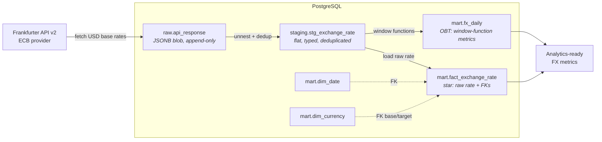

# currency-api-v2

An incremental **ELT pipeline** that ingests foreign-exchange rates from the Frankfurter API into PostgreSQL, following a **medallion architecture** (raw → staging → mart). Transformation logic lives in SQL and runs inside the database, not in the application layer.

> **Why ELT?** It keeps raw data immutable and replayable, pushes all transformation into version-controlled SQL, and mirrors how modern warehouses (BigQuery, Snowflake) are built.

**Status:** Complete. Loads raw → staging → two parallel marts (denormalized OBT + dimensional star schema).

---

## Who is this for?

Models what an **import/export or procurement team** needs: track daily FX rates with day-over-day change, moving averages, and volatility to support decisions like *"lock the cost in baht now or wait?"* and to gauge currency risk.

---

## Architecture



| Layer | Table | Role |
|-------|-------|------|
| **Raw** | `raw.api_response` | Unmodified JSON payload as `JSONB`, append-only — full replay and audit. |
| **Staging** | `staging.stg_exchange_rate` | Flat, typed rows. Deduplicated with `ROW_NUMBER()`, upserted via `ON CONFLICT` on the natural key. |
| **Mart — OBT** | `mart.fx_daily` | Wide table: prev-day rate, daily % change, 7/30-day moving averages, 30-day volatility. No joins needed. |
| **Mart — Star** | `mart.fact_exchange_rate` | Fact holding raw `rate` only, FKs to `dim_date` and `dim_currency` (role-playing: base + target). |
| **Dimension** | `mart.dim_date` | Calendar dimension generated with `generate_series`. |
| **Dimension** | `mart.dim_currency` | ISO 4217 reference; natural key (`CHAR(3)`), seeded as static data. |

---

## Why two marts?

`fx_daily` (OBT) and the star schema are **parallel marts**, both built from staging — neither derives from the other:

- **`fx_daily`** — one wide table, no joins, fast for BI. Rigid: new angles need schema changes.
- **Star schema** — `fact_exchange_rate` keeps only the raw `rate`; derived metrics stay out by design (they're computed across rows, not additive at the fact's grain). Flexible to slice via dimensions.

Showing both patterns on one source is intentional. In a production warehouse where the fact is the central source of truth, a derived layer like `fx_daily` would be built *from* the fact rather than alongside it.

A few specifics worth noting: `dim_currency` keys on the **ISO 4217 code** (immutable, single-source) rather than a surrogate; `fact_exchange_rate` references `dim_currency` **twice** (base + target) as a role-playing dimension; and FK constraints enforce integrity, so loads need no manual validation joins.

---

## Tech Stack

| Concern | Choice |
|---------|--------|
| Language | Python 3 (`requests`, `SQLAlchemy`, `python-dotenv`, `logging`) |
| Database | PostgreSQL |
| Data source | [Frankfurter API v2](https://frankfurter.dev) (ECB provider) |
| Transformation | SQL (executed in-database) |
| Linting | SQLFluff |

---

## Data Source Notes

- **Base:** USD &nbsp;·&nbsp; **Quotes:** THB, JPY, EUR, GBP, SGD
- **Provider pinned to ECB** to avoid blended-rate drift across central banks and keep the series consistent.
- **The real gap is missing _dates_, not currency pairs.** The ECB doesn't publish on weekends/holidays, so the pipeline tolerates non-continuous date coverage.

---

## How to Run

**Prerequisites:** Python 3.10+, a running PostgreSQL instance, and `psql` on your PATH (`psql --version` to check).
> On Windows, `psql` often isn't on PATH — add `C:\Program Files\PostgreSQL\<version>\bin`, then open a new terminal.

```bash
# 1. Clone and install
git clone https://github.com/Kirakiraz/currency-api-v2.git
cd currency-api-v2
pip install -r requirements.txt

# 2. Configure — copy the example and fill in DB credentials
cp .env.example .env

# 3. Build schema + seed data (one-time). Run from the repo root.
createdb -U <your_user> currency_db
psql -U <your_user> -d currency_db -f init.sql

# 4. Run the pipeline
python main.py
```

- Replace `<your_user>` with your PostgreSQL user (often `postgres`), matching `.env`.
- **Run step 3 from the repo root** — `init.sql` resolves relative `\i` paths (`sql/ddl/`, `sql/seed/`) from your current directory.

---

## Design Decisions

- **ELT over ETL** — raw lands first; transforms run in SQL, immutable and reproducible.
- **JSONB raw layer** — downstream logic can be re-derived without re-calling the API.
- **Incremental loading** — `get_last_loaded_date()` reads the max `source_date` in staging, so each run pulls only new data.
- **Idempotent upserts** — `ON CONFLICT` on natural keys means re-running never duplicates rows.

(Mart modeling choices — parallel marts, natural keys, role-playing dimension — are covered in *Why two marts?*.)

---

## Future Improvements

- **Cloud migration** — port to BigQuery (partition the fact by date) and add scheduled orchestration (Cloud Composer / Airflow) in place of manual runs.
- **Incremental staging** — the staging step re-processes the full raw table each run; `load_to_raw()` returns the new `raw.id`, which can scope the transform to new rows.
- **Data quality checks** — automated validation (row counts, null checks, rate bounds) between layers.
- **Tests** — `pytest` coverage for the extract/load functions.

---

## Project Structure

```
currency-api-v2/
├── sql/
│   ├── ddl/
│   │   └── schema.sql                  # CREATE all schemas/tables (run once)
│   ├── seed/
│   │   ├── dim_date.sql                # generate calendar dimension
│   │   └── dim_currency.sql            # static ISO 4217 reference data
│   └── transform/
│       ├── stg_exchange_rate.sql       # unnest + dedup raw → staging
│       ├── fx_daily.sql                # window-function metrics → OBT mart
│       └── fact_exchange_rate.sql      # raw rate → star schema fact
├── init.sql                            # orchestrator: \i ddl + seed
├── main.py                             # fetch + load + run SQL transforms
├── requirements.txt
├── .env.example
├── .sqlfluff
└── .gitignore
```
